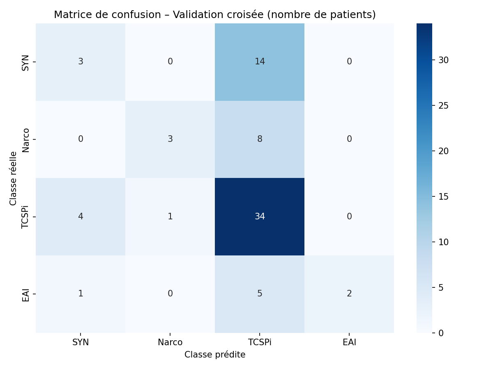
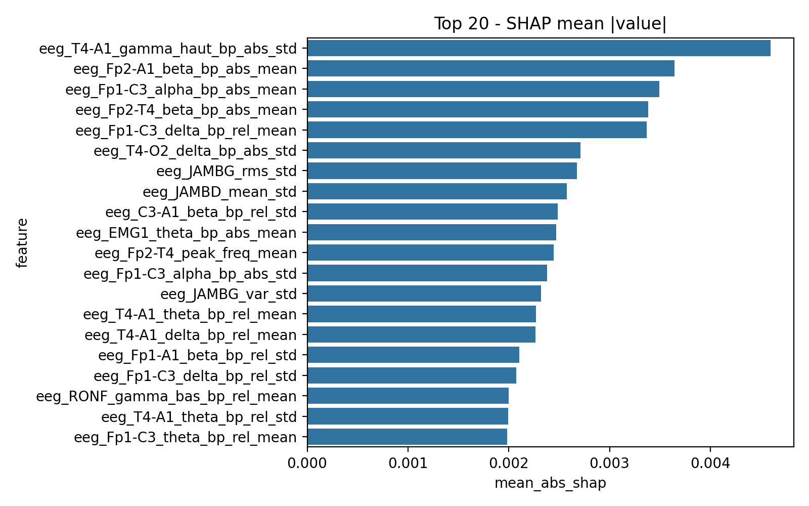

# Rapport d’analyse – Classification RBD / EEG–EMG

## 1. Performances globales du modèle

Cette section résume les performances du modèle (RandomForest) sur les features extraits des segments REM (EEG / EMG).

### Performances moyennes (cross-validation)

- Accuracy moyenne : **nan**
- Balanced accuracy : **0.423**
- F1-score macro : **0.378**
- Recall macro : **0.423**

### 1.1 Matrice de confusion

- Courbes ROC non trouvées.

## 2. Explicabilité globale (XAI)

### 2.1 Importances globales des features

- Heatmap XAI par groupe non trouvée.

## 3. Attributions locales par patient

- Aucune attribution locale trouvée.

## 4. Statistiques de groupe

Statistiques disponibles :

- **knn_diagnostic.csv** : 75 lignes, 5 colonnes
- **shap_band_stats.csv** : 8 lignes, 4 colonnes
- **shap_top_features.csv** : 20 lignes, 5 colonnes
- **train_metrics_knn.csv** : 6 lignes, 6 colonnes
- **train_metrics_rf.csv** : 6 lignes, 6 colonnes
- **train_metrics_rf_confusion.csv** : 4 lignes, 5 colonnes
- **train_metrics_xgb.csv** : 6 lignes, 6 colonnes

Les features les plus contributives sont principalement : **eeg_T4-A1_gamma_haut_bp_abs_std, eeg_Fp2-A1_beta_bp_abs_mean, eeg_Fp1-C3_alpha_bp_abs_mean**.
